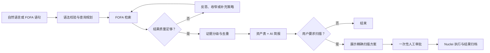
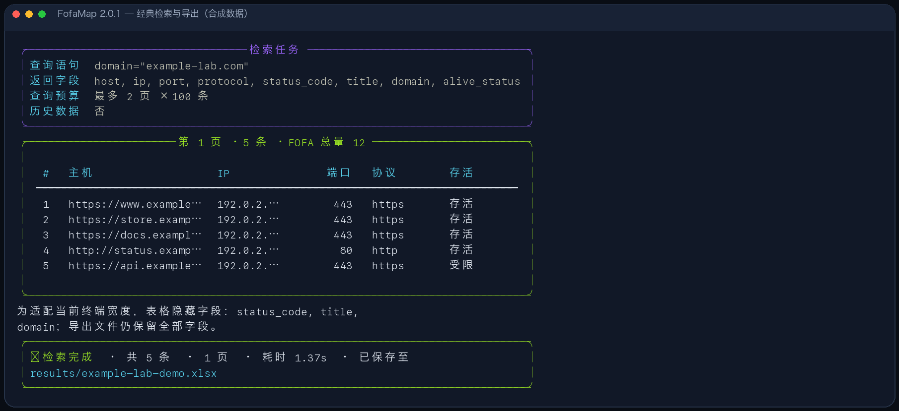
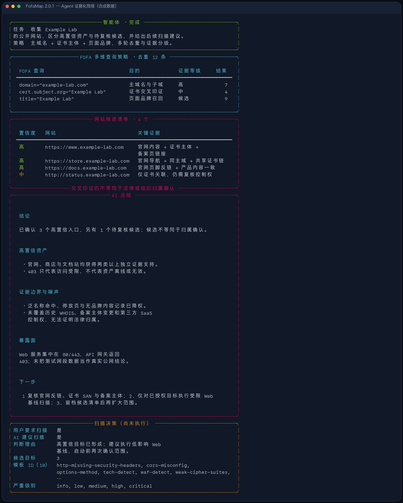
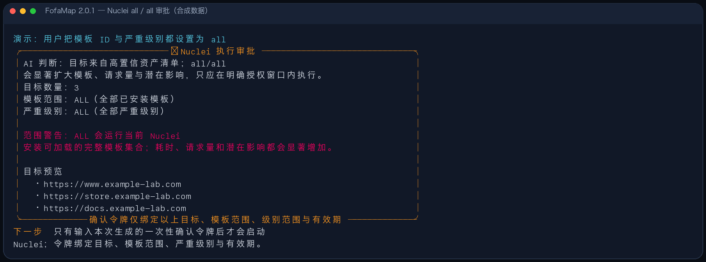
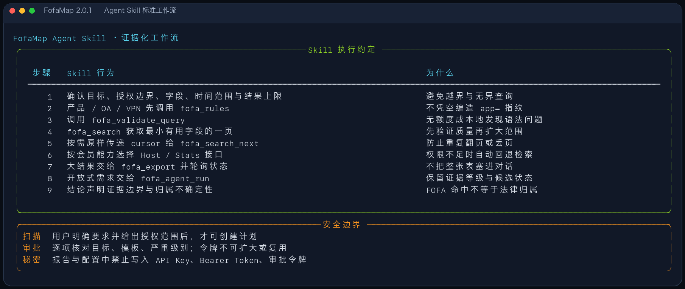
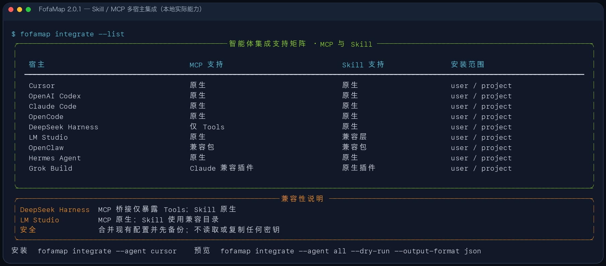
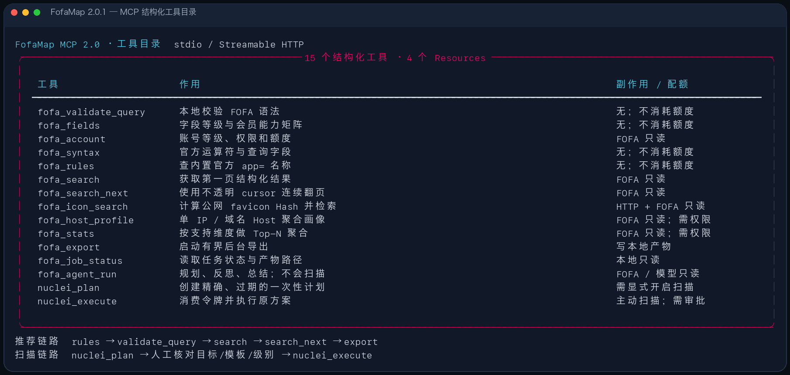
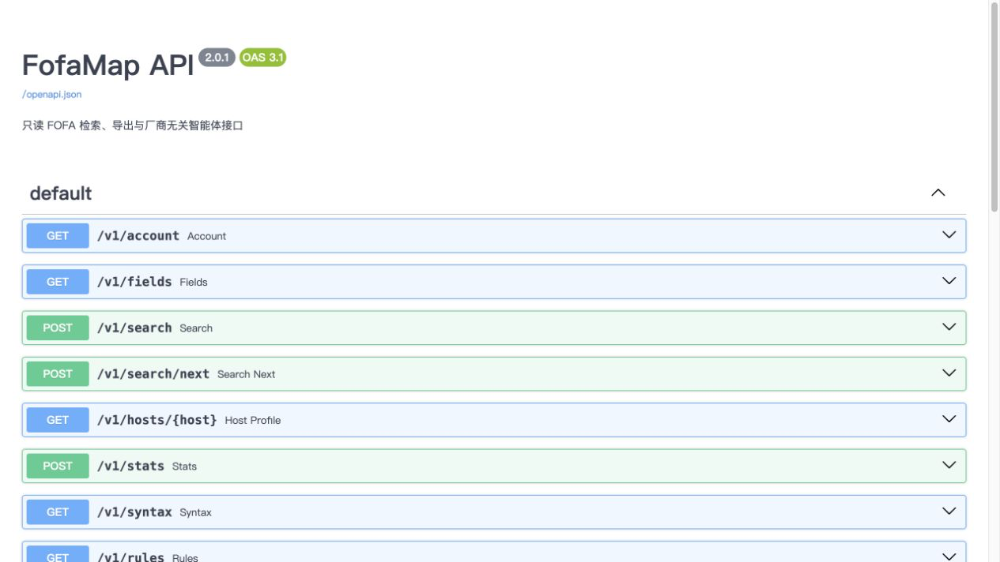

# 🗺️ FofaMap 2.0.1 - 证据驱动的资产测绘智能体


> 把自然语言资产发现、FOFA 证据检索、AI 反思总结与经人工审批的 Nuclei 扫描，放进同一条可追溯工作流。

<p align="center">
  <a href="https://github.com/asaotomo/FofaMap/releases/tag/v2.0.1"></a>
  <a href="https://github.com/asaotomo/FofaMap/actions/workflows/ci.yml"></a>
  <a href="https://github.com/asaotomo/FofaMap/actions/workflows/security.yml"></a>
  <a href="https://www.python.org/"></a>
  <a href="LICENSE"></a>
  
</p>

<p align="center">
  <a href="#local-agent"></a>
  <a href="#cli-reference"></a>
  <a href="#agent-mcp-skill"></a>
  <a href="#agent-mcp-skill"></a>
  <a href="#rest-api"></a>
  <a href="#nuclei"></a>
</p>

FofaMap 既能像传统 CLI 一样直接执行 FOFA 语句，也能让 Agent 把一句自然语言需求拆成多组查询，依据真实命中自我反思，最后输出带证据边界的资产简报。需要扫描时，它只先生成方案；目标、模板和严重级别必须经过一次性审批才能交给 Nuclei。

> 海报与截图不包含真实账号、密钥或资产信息。终端案例使用合成域名和文档保留网段。

## 📚 文档导航

| 新用户 | 日常使用 | AI 与平台接入 | 安全与维护 |
|---|---|---|---|
| [5 分钟上手](#quick-start) | [FOFA 查询教程](#fofa-query-guide) | [本地 Agent](#local-agent) | [Nuclei 审批](#nuclei) |
| [Windows / macOS / Linux](#install-platforms) | [完整 CLI 参数](#cli-reference) | [MCP / Skill](#agent-mcp-skill) | [配置与密钥](#configuration) |
| [三种入口怎么选](#entrypoints) | [分页、字段与导出](#pagination-output) | [REST / OpenAPI](#rest-api) | [常见问题](#troubleshooting) |

快速链接：[效果预览](#screenshots) · [项目结构](#architecture) · [迁移指南](MIGRATION.md) · [安全策略](SECURITY.md) · [Agent 集成](docs/AGENT_INTEGRATIONS.md)

---

## ✨ 为什么是 2.0.1

FofaMap 2.0 完成了从查询脚本到自然语言助手的跨越；2.0.1 把 Agent、Skill、MCP、CLI 和扫描审批收敛到同一套核心契约。

| 能力 | 2.0.1 的做法 |
|---|---|
| 经典查询 | `-q / -hq / -cq / -ico / -bq` 保持可用，不需要 AI 模型 |
| 自然语言侦察 | 规划多组 FOFA 查询，按命中量和新增资产反思，最多两轮修正 |
| 组织网站收集 | 输出 `corroborated / observed / candidate` 候选与证据，不把搜索命中直接写成归属结论 |
| 高质量总结 | 固定覆盖结论、高置信资产、噪声、暴露面、证据缺口和下一步 |
| Agent 接入 | 一条命令安装到 Cursor、Codex、Claude Code、LM Studio、OpenCode 等宿主 |
| Nuclei 基线 | 默认组合 10 个低影响 Web/TLS 基线模板，覆盖常见配置与证书检查 |
| 自定义扫描范围 | 模板 ID 和严重级别均可修改；输入 `all` 表示该维度全部执行 |
| 审批边界 | 精确展示目标、模板和级别；一次性令牌绑定方案，`-batch` 也不能绕过 |
| 数据输出 | XLSX / CSV / JSONL；连续分页、流式大结果导出、Markdown Agent 报告 |

### 工作流



Agent 负责规划和总结；查询、分页、字段映射、导出、审批与扫描均由确定性代码执行。鉴权失败、额度耗尽、权限不足、限速或网络错误会明确失败，不会被伪装成“0 结果”。

---

<a id="screenshots"></a>

## 🖥️ 效果预览

### 经典 FOFA 查询

普通查询不需要模型。终端展示适合人读的字段，导出文件仍保留完整字段。



### Agent 证据化简报

开放式任务会组合域名、证书、页面品牌和内置规则；总结明确区分高置信资产、候选、噪声与尚未覆盖的证据。



### `all / all` 扫描审批

模板 ID 和严重级别都支持 `all`。这意味着运行当前 Nuclei 可加载的全部模板和全部严重级别，程序会显示红色范围警告并再次要求审批。



截图中的 `example-lab.com` 为合成演示名称，`192.0.2.0/24` 为文档保留网段；它们不代表真实扫描结果。

---

<a id="quick-start"></a>

## 🚀 5 分钟上手

### 1. 安装

需要 Python 3.10+。macOS、Linux 和 Windows 均可运行。

```bash
git clone https://github.com/asaotomo/FofaMap.git
cd FofaMap
python3 -m venv .venv
. .venv/bin/activate                 # Windows: .venv\Scripts\activate
python -m pip install -e .
```

```bash
fofamap --version
fofamap --help
```

<a id="install-platforms"></a>

### 跨平台安装说明

<details>
<summary><strong>macOS / Linux</strong></summary>

```bash
git clone https://github.com/asaotomo/FofaMap.git
cd FofaMap
python3 -m venv .venv
source .venv/bin/activate
python -m pip install --upgrade pip
python -m pip install -e .
```

每次打开新终端后，在项目目录执行 `source .venv/bin/activate`。如果不想激活虚拟环境，也可以直接使用 `.venv/bin/fofamap`。

</details>

<details>
<summary><strong>Windows PowerShell</strong></summary>

```powershell
git clone https://github.com/asaotomo/FofaMap.git
cd FofaMap
py -3 -m venv .venv
.\.venv\Scripts\Activate.ps1
python -m pip install --upgrade pip
python -m pip install -e .
```

如果 PowerShell 阻止激活脚本，可为当前用户设置签名策略，或直接运行 `.\.venv\Scripts\fofamap.exe`。Windows 命令中的 FOFA 双引号需要转义：

```powershell
fofamap -q "app=\"ThinkPHP\" && country=\"CN\""
```

</details>

<details>
<summary><strong>更新、重装与卸载</strong></summary>

```bash
# Git 仓库更新
git pull
python -m pip install -e .

# 仅重装当前源码
python -m pip install --force-reinstall -e .

# 卸载 Python 包；不会主动删除 results/ 和本地配置
python -m pip uninstall fofamap
```

从 2.0 升级时不要直接复用旧版明文密钥配置，先阅读 [MIGRATION.md](MIGRATION.md) 并轮换任何曾提交到 Git 的密钥。

</details>

### 安装 Nuclei（可选）

只有主动扫描需要 Nuclei；FOFA 查询、Agent、MCP 和 REST 的只读能力均可独立运行。

```bash
nuclei -version
```

如果找不到命令，请从 [ProjectDiscovery Nuclei Releases](https://github.com/projectdiscovery/nuclei/releases) 下载与操作系统匹配的版本，并放入 `PATH` 或项目根目录。更新 Nuclei 与模板：

```bash
fofamap -up
```

### 2. 初始化

```bash
fofamap init
```

向导会配置 FOFA API 密钥、可选的 AI 提供商，以及默认字段、分页、导出格式、存活检测和并发参数。密钥优先存入系统钥匙串；钥匙串不可用时，程序会明确询问是否写入本地配置文件。macOS/Linux 会将文件权限设为 `0600`；Windows 依赖当前用户目录 ACL，程序会明确提示优先使用系统钥匙串或环境变量。

也可以使用环境变量：

```bash
export FOFA_API_KEY='你的 FOFA API Key'
export OPENAI_API_KEY='仅本地 -ai 模式需要'
```

`.env` 只作为配置示例，程序不会自动加载。完整选项见 [config/settings.example.yaml](config/settings.example.yaml)。

### 3. 第一次查询

```bash
# 无参数进入交互向导
fofamap

# 经典 FOFA 语法；不需要模型
fofamap -q 'domain="example.com"' -p 2 --size 100

# 自然语言 Agent；需要配置模型
fofamap -ai '收集 Example 公司的公开网站，区分高置信资产与待复核候选'
```

结果默认写入 `results/{查询摘要}_{时间戳}/`。

---

<a id="entrypoints"></a>

## 🧭 三种入口怎么选

| 使用方式 | FOFA 密钥 | 模型密钥 | 适合场景 |
|---|:---:|:---:|---|
| 交互向导 / 经典 CLI | ✅ | ❌ | 已知 FOFA 语法、主机画像、统计、图标和批量任务 |
| 本地 `-ai` Agent | ✅ | ✅ | 用自然语言规划、反思、证据分级并生成报告 |
| MCP / Skill | ✅ | ❌* | 让 Cursor、Codex、Claude Code、LM Studio 等宿主模型调用 |

\* MCP 宿主本身提供对话模型，因此通常不需要再给 FofaMap 配第二套模型密钥。主动扫描还要求本机安装 Nuclei，并显式开启扫描能力。

### 交互向导

```bash
fofamap
```

方向键可选择标准查询、AI 智能侦察、主机画像、统计聚合、图标反查、批量查询、规则库、初始化或集成管理。

<a id="fofa-query-guide"></a>

## 🔎 FOFA 查询入门

### 查询语句与返回字段不是一回事

- **查询语句**决定“找什么”，例如 `domain="example.com" && status_code="200"`；
- **返回字段**决定“每条结果带回什么”，使用 `-f host,ip,port,title`；
- `status_code` 可以用于查询，但它是兼容返回字段，不保证所有账号和接口都能直接返回；
- 不确定字段权限时先运行 `fofamap account` 和 `fofamap fields`。

### 常用运算符

| 运算符 | 含义 | 示例 |
|---|---|---|
| `=` | 包含匹配 | `title="login"` |
| `==` | 完全匹配，通常更快 | `domain=="example.com"` |
| `!=` | 排除匹配 | `country!="US"` |
| `&&` | 同时满足 | `app="nginx" && country="CN"` |
| `\|\|` | 满足任一条件 | `port="80" \|\| port="443"` |
| `*=` | 部分字段的模糊匹配 | 具体支持范围以 FOFA 当前接口为准 |
| `()` | 分组并明确优先级 | `(port="80" \|\| port="443") && country="CN"` |

本地查看完整的官方语法目录，不消耗 FOFA 查询额度：

```bash
fofamap syntax
fofamap syntax --output-format json
```

### 常用查询字段

| 目标 | 示例 | 说明 |
|---|---|---|
| 根域名及子域 | `domain="example.com"` | 适合域名资产盘点 |
| 精确根域名 | `domain=="example.com"` | 避免包含式扩大 |
| IP / C 段 | `ip="192.0.2.10"`、`ip="192.0.2.0/24"` | 示例使用文档保留网段 |
| 端口 | `port="443"` | 与产品、地域等组合使用 |
| 标题 / 正文 | `title="管理后台"`、`body="powered by"` | 容易产生泛命中，应复核内容 |
| 服务与产品 | `protocol="https"`、`product="NGINX"` | 产品字段取决于账号权限 |
| FOFA 应用规则 | `app="ThinkPHP"` | 产品名应优先来自规则库 |
| 国家 / 地区 | `country="CN"`、`region="Zhejiang"` | 过度限制可能导致 0 结果 |
| 组织 / ASN | `org="Example Org"`、`asn="13649"` | 组织名命中不等于资产归属 |
| ICP | `icp="示例备案号"` | 结合官网或权威来源复核 |
| 证书 | `cert.subject.org="Example Org"` | 证书关联只是归属证据之一 |
| 图标 | `icon_hash="123456789"` | 建议使用 `-ico` 自动计算 |

> 产品、OA、VPN、中间件、数据库、摄像头、CMS 或运维面板，请先查询内置规则库，不要猜测 `app=` 名称。

```bash
fofamap rules --rule ThinkPHP
fofamap rules -k OA
fofamap --rule ThinkPHP -p 2
# 组合条件时，把规则库返回值明确写入 -q
fofamap -q 'app="ThinkPHP" && country="CN"'
```

只传 `--rule` 时，FofaMap 会把规则名称映射为查询语句。组合地域、端口等条件时，请先查看规则库返回值，再明确写入 `-q`。完整规则以 FOFA 官方规则库为准，FofaMap 内置的是高价值、可审计子集。

### Shell 引号速查

```bash
# macOS / Linux：外层单引号最省心
fofamap -q 'app="nginx" && country="CN"'

# Windows PowerShell：外层双引号，内部双引号转义
fofamap -q "app=\"nginx\" && country=\"CN\""
```

### 经典 CLI

```bash
# 标准检索
fofamap -q 'app="nginx" && country="CN"' -p 3 --size 100

# 主机聚合画像 / 统计聚合
fofamap -hq '1.1.1.1'
fofamap -cq 'app="nginx"' --size 10

# 网站图标哈希反查
fofamap -ico 'https://example.com'
fofamap --icon-file ./favicon.ico

# 内置规则库与批量查询
fofamap rules --rule ThinkPHP
fofamap -q 'country="CN"' --rule ThinkPHP
fofamap -bq queries.txt --export-format xlsx
```

筛选、存活检测与导出：

```bash
fofamap -q 'domain="example.com"' \
  -i 200,403 \
  -k login,admin \
  --check-alive \
  --dedupe-by host,ip,port \
  --export-format jsonl \
  -o results/example.jsonl
```

| 任务 | 兼容参数 |
|---|---|
| AI / 标准查询 | `-ai / --ai-query`、`-q / --query` |
| 主机 / 统计 | `-hq / --host-query`、`-cq / --count-query` |
| 图标 / 批量 | `-ico / --icon-query`、`-bq / --bat-query` |
| 状态码 / 关键词过滤 | `-i / --include`、`-k / --key-word` |
| 页数 / 字段 / 输出 | `-p`、`-f`、`-o` |

2.0 命令逐项对照见 [V2 CLI 兼容清单](docs/V2_CLI_COMPATIBILITY.md)。

<a id="cli-reference"></a>

## 🛠️ 完整 CLI 参数手册

查看当前安装版本的权威帮助：

```bash
fofamap --help
fofamap --version
```

### 功能命令

| 命令 | 是否用 FOFA 额度 | 用途 |
|---|:---:|---|
| `fofamap` | 视所选任务 | 打开中文交互向导 |
| `fofamap account` | ✅ | 查看账号、会员等级、接口权限与额度 |
| `fofamap fields` | ❌ | 查看返回字段、会员字段等级与聚合能力 |
| `fofamap syntax` | ❌ | 查看内置的 FOFA 官方语法目录 |
| `fofamap rules` | ❌ | 列出或搜索内置 `app=` 规则子集 |
| `fofamap init` | ❌ | 打开安全初始化向导 |
| `fofamap integrate` | ❌ | 安装、预览或卸载 MCP / Skill 集成 |
| `fofamap serve` | ❌* | 启动 REST 服务，默认 `127.0.0.1:8000` |
| `fofamap -V, --version` | ❌ | 输出版本并退出 |

\* 启动服务本身不消耗额度；调用查询接口时会消耗。

### 查询与分析参数

| 参数 | 值 | 作用 | 是否需要模型 |
|---|---|---|:---:|
| `-ai, --ai-query` | 自然语言 | Agent 规划、检索、反思、总结 | ✅ |
| `-q, --query` | FOFA 语句 | 标准资产检索 | ❌ |
| `-hq, --host-query` | IP 或域名 | Host 聚合画像 | ❌ |
| `--host-detail / --no-host-detail` | 开关 | Host 是否返回端口详情；默认开启 | ❌ |
| `-cq, --count-query` | FOFA 语句 | 统计聚合查询 | ❌ |
| `-ico, --icon-query` | URL | 下载公网 favicon、计算 Hash 并反查 | ❌ |
| `--icon-file` | 本地文件 | 对不超过 4 MiB 的本地图标计算 Hash | ❌ |
| `-bq, --bat-query` | TXT 路径 | 批量读取 IP、域名或 FOFA 语句 | ❌ |
| `--rule` | 规则名称 | 将内置规则映射为 `app=` 查询 | ❌ |

如果 `-q / -ai / -hq / -cq / -ico / -bq` 只写参数不写值，交互终端会提示输入；自动化脚本应始终显式传值。

### 范围、字段与过滤参数

| 参数 | 默认值 / 范围 | 说明 |
|---|---|---|
| `-f, --query-fields` | 配置文件字段 | 逗号分隔的返回字段，例如 `host,ip,port,title` |
| `--smart-fields / --no-smart-fields` | AI 模式默认开启 | 按账号等级和任务选择字段；与 `-f` 同时出现时智能字段优先 |
| `-p, --pages` | 配置 `end_page`；1–10000 | 本次最多查询页数 |
| `--size` | 查询默认 100；1–10000 | 查询时为每页条数；统计时为每个维度的 Top N |
| `--max-records` | 配置默认 10000；1–1000000 | 本次最多接收记录数 |
| `--batch-group-size` | 100；1–100 | 批量 IP / 域名每组组合成一条 OR 查询；`1` 关闭组合 |
| `--full / --no-full` | 跟随配置 | 是否查询历史数据；可能影响额度与权限 |
| `--dedupe-by` | 不自动指定 | 逗号分隔的去重键，例如 `host,ip,port` |
| `-i, --include` | 无 | 本地仅保留指定状态码，例如 `200,301,403` |
| `-k, --key-word` | 无 | 本地任一关键词匹配，例如 `登录,后台` |
| `--check-alive / --no-check-alive` | 跟随配置 | 对没有可用状态信息的目标做安全 HTTP 存活检测 |

过滤顺序为：取得 FOFA 结果 → 必要时存活检测 → 状态码过滤 → 关键词过滤 → 展示与导出。若 FOFA 已返回可用状态码，不会为了 `-i` 无条件访问每个目标。

### 展示与导出参数

| 参数 | 默认值 | 说明 |
|---|---|---|
| `-o, --outfile` | 自动命名 | 完整导出文件路径；后缀可帮助推断格式 |
| `--outdir` | `results` | 自动命名文件的输出目录 |
| `--export-format` | 配置值，默认 `xlsx` | `xlsx`、`csv` 或 `jsonl` |
| `--save / --no-save` | 保存 | 是否自动保存完整结果 |
| `--display-rows` | 100；1–500 | 每页终端最多展示行数，不影响导出完整性 |
| `--output-format` | `table` | 终端格式：`table`、`json`、`jsonl` |
| `--json` | 关闭 | 等价于 `--output-format json` |
| `--report / --no-report` | 开启 | AI 模式是否生成 Markdown 报告 |
| `--report-file` | 自动命名 | AI Markdown 报告路径 |

人类阅读使用 `table`；Shell、CI 或其他 Agent 调用使用 `json/jsonl`：

```bash
# 不保存文件，只把稳定 JSON 输出给下游程序
fofamap -q 'domain="example.com"' \
  -f host,ip,port,title \
  --output-format json \
  --no-save

# 大结果优先 JSONL 或 CSV
fofamap -q 'app="nginx"' \
  -p 10 --max-records 1000 \
  --export-format jsonl \
  -o results/nginx.jsonl
```

### 扫描、更新与兼容参数

| 参数 | 默认值 / 范围 | 说明 |
|---|---|---|
| `-n, --nuclei` | 关闭 | 查询后生成扫描方案并进入人工审批 |
| `--nuclei-id` | 10 模板基线 | 可重复；精确模板 ID；`all` 为全部已安装模板 |
| `--severity` | 方案级别 | 逗号分隔 `info,low,medium,high,critical,unknown`；`all` 为全部 |
| `--scan-max-targets` | 200；1–10000 | 单次审批允许的最大目标数 |
| `-batch, --batch` | 关闭 | 兼容 2.0 无人值守标记；不会跳过扫描审批 |
| `-up, --update` | 关闭 | 调用本机 Nuclei 更新程序和模板 |
| `-init, --init` | 关闭 | `fofamap init` 的 2.0 兼容写法 |

### 批量文件格式

`queries.txt` 每行可写 IP、域名或完整 FOFA 语句；空行会忽略：

```text
192.0.2.10
example.com
app="nginx" && country="CN"
```

- IP 会规范化为 `ip="…"`；
- 域名会规范化为 `domain="…"`；
- 已有 FOFA 语句保持原样；
- 默认把最多 100 个纯 IP / 域名组成有界 OR 查询，降低请求次数；
- `--batch-group-size 1` 可让每行独立查询。

### 退出码

| 退出码 | 含义 |
|---:|---|
| `0` | 成功完成 |
| `2` | 参数、FOFA、模型、权限或任务执行错误 |
| `130` | 用户按 `Ctrl+C` 取消 |

---

<a id="agent-mcp-skill"></a>

## 🤖 Agent / MCP / Skill

<a id="local-agent"></a>

### 本地 Agent

```bash
fofamap -ai '查找授权范围内暴露的 ThinkPHP，按证据等级总结并建议下一步'
```

Agent 会依次完成：

1. 识别资产检索、单主机、统计或图标任务；
2. 对产品名优先查询内置规则库，避免凭空编写指纹；
3. 生成并校验互补 FOFA 语句；
4. 基于命中数、新增量和样本质量最多反思两轮；
5. 去重并标记证据等级；
6. 输出资产表、Markdown 报告和“尚未执行”的扫描建议。

推荐把对象、范围、期望结果和是否允许扫描写清楚：

```bash
# 网站收集：强调证据和候选边界
fofamap -ai '收集 Example 公司的公开网站，给出每个候选的证据等级，不要把泛名称命中写成已确认归属'

# 暴露面分析：限制地域与结果预算
fofamap -ai '分析授权范围内中国地区的 Example 产品暴露面，按协议、端口和产品版本总结，最多返回 500 条'

# 明确扫描意图：仍会进入人工审批
fofamap -ai '收集授权域名 example.com 的网站，并对高置信目标建议 Web 基线扫描'
```

组织网站任务中的候选状态：

| 状态 | 含义 | 写报告时怎么处理 |
|---|---|---|
| `corroborated` | 两类或以上独立证据相互印证 | 列为高置信资产，但仍声明非法律归属证明 |
| `observed` | 已从查询结果直接观察到相关内容 | 列为观察资产，说明命中来源 |
| `candidate` | 只有假设、泛名称或单类证据 | 放入待复核清单，不写成已确认资产 |

AI 总结固定关注：结论、高置信资产、噪声与误报、暴露面、证据边界、覆盖缺口和下一步。模型不会获得任意 Shell 权限，也不能自行执行 Nuclei。

AI 提供商支持 OpenAI、DeepSeek、Anthropic、Ollama、LM Studio 及兼容接口。规划、语法修复、反思和总结可分别路由；跨提供商回退默认关闭。

### Skill 如何约束 Agent

Skill 不只是提示词示例，它规定了规则库优先、语法校验、按需翻页、大结果导出、证据边界和扫描审批顺序。



### 一键接入 AI 宿主

```bash
fofamap integrate --list
fofamap integrate --agent cursor
fofamap integrate --agent codex
fofamap integrate --agent claude
fofamap integrate --agent lmstudio
fofamap integrate --agent all --dry-run
```

当前集成覆盖 Cursor、Codex、Claude Code、OpenCode、DeepSeek Harness、LM Studio、OpenClaw、Hermes 和 Grok Build。安装器会自动写入当前 Python 与 `mcp_server.py` 的绝对路径，不依赖 GUI 应用的 `PATH`；同时会合并已有配置、首次修改前创建备份，并且不会读取或复制密钥。



如果曾用早期 2.0.1 安装器生成过 `"command": "fofamap-mcp"`，重新运行相同的集成命令即可原地升级。卸载只移除 FofaMap 管理的条目：

```bash
fofamap integrate --agent cursor --uninstall
```

集成参数：

| 参数 | 默认值 | 用途 |
|---|---|---|
| `--agent` | 必填 | `cursor`、`codex`、`claude`、`opencode`、`deepseek-harness`、`lmstudio`、`openclaw`、`hermes`、`grok` 或 `all` |
| `--scope` | `user` | `user` 安装到用户目录；`project` 安装到项目目录 |
| `--list` | 关闭 | 查看 MCP / Skill 支持矩阵 |
| `--uninstall` | 关闭 | 仅移除 FofaMap 管理的条目 |
| `--dry-run` | 关闭 | 只展示将发生的变更 |
| `--server-command` | 自动解析 | 高级覆盖项；默认使用当前 Python 与 `mcp_server.py` 的绝对路径 |
| `--project-root` | 当前目录 | project scope 的项目根目录 |
| `--force` | 关闭 | 备份后替换同名但非 FofaMap 管理的 Skill / 插件 |

项目级安装示例：

```bash
fofamap integrate \
  --agent claude \
  --scope project \
  --project-root /path/to/project
```

只有在宿主必须使用另一套已安装环境时，才需要覆盖默认命令：

```bash
fofamap integrate --agent cursor --server-command /absolute/path/to/fofamap-mcp
```

### MCP 工具分层

| 类别 | 主要工具 |
|---|---|
| 准备 | `fofa_account`、`fofa_fields`、`fofa_syntax`、`fofa_rules`、`fofa_validate_query` |
| 检索 | `fofa_search`、`fofa_search_next`、`fofa_host_profile`、`fofa_stats`、`fofa_icon_search` |
| 编排与导出 | `fofa_agent_run`、`fofa_export`、`fofa_job_status` |
| 受控扫描 | `nuclei_plan`、`nuclei_execute` |



推荐调用顺序：规则库 → 语法校验 → 单页查询 → 按 `next_cursor` 连续翻页 → 大结果导出。开放式中文需求可以直接调用 `fofa_agent_run`。

```bash
# 手工启动 stdio MCP
fofamap-mcp

# 本机 Streamable HTTP
fofamap-mcp --transport streamable-http --host 127.0.0.1 --port 8001
```

更详细的宿主路径、配置位置与故障排查见 [Agent 集成文档](docs/AGENT_INTEGRATIONS.md)；能力对齐结论见 [Agent / Skill / CLI 审计](docs/AGENT_SKILL_CLI_AUDIT.md)。

---

<a id="nuclei"></a>

## ☢️ Nuclei：扫描前必须审批

> 只对已获得明确授权的目标执行主动扫描。

Nuclei 是可选依赖。先确认它在 `PATH` 中：

```bash
nuclei -version
```

命令行会始终显示审批；MCP / REST 还需要显式打开扫描开关：

```bash
export FOFAMAP_ENABLE_SCANNING=true
export FOFAMAP_SCAN_APPROVAL_SECRET='至少24个字符的高熵随机值'
```

### 默认不是单模板

没有指定 `--nuclei-id` 时，2.0.1 使用有界的 `web-baseline`：

```text
http-missing-security-headers  cors-misconfig  options-method
tech-detect                    waf-detect      weak-cipher-suites
deprecated-tls                 expired-ssl     self-signed-ssl
mismatched-ssl-certificate
```

这套基线覆盖常见 Web 安全头、CORS、OPTIONS、技术/WAF 识别和 TLS 配置检查。它是低影响基线，不等于全模板漏洞扫描。

### 自定义模板与严重级别

```bash
# 默认 10 模板基线
fofamap -q 'domain="example.com"' -n

# 指定模板 ID；可重复传入
fofamap -q 'domain="example.com"' -n \
  --nuclei-id cors-misconfig \
  --nuclei-id tech-detect \
  --severity info,low,medium

# 全部已安装模板 + 全部严重级别
fofamap -q 'domain="example.com"' -n \
  --nuclei-id all \
  --severity all
```

| 输入 | 含义 |
|---|---|
| 不传模板 ID | 使用 10 个 `web-baseline` 模板 |
| 一个或多个模板 ID | 仅执行允许列表中的这些模板 |
| `--nuclei-id all` | 取消模板过滤，使用当前安装可加载的全部模板 |
| 指定严重级别 | 只保留对应严重级别 |
| `--severity all` | 取消严重级别过滤 |
| 模板与级别均为 `all` | 完整模板集合 + 全部级别；显示高风险范围警告 |

每次执行前，终端都会展示目标、模板范围、严重级别和 AI 判断。用户可执行、修改范围、仅生成报告或取消。确认令牌绑定这次方案和有效期，用后即废；`-batch` 不会跳过审批。

MCP / REST 的调用顺序是 `nuclei_plan` → 人工确认 → `nuclei_execute`。基线外的精确模板 ID 需要管理员通过 `FOFAMAP_NUCLEI_ID_ALLOWLIST` 加入允许列表。

---

<a id="pagination-output"></a>

## 📄 分页、字段与输出

### 分页预算

| 入口 | 默认行为 | 调整方式 |
|---|---|---|
| CLI `-q` / 向导 | `end_page` 默认 2 页，每页 100 条 | `-p / --pages`、`--size`、`--max-records` |
| MCP `fofa_search` | 每次 1 页、100 条 | 把 `next_cursor` 原样交给 `fofa_search_next` |
| `-ai` / `fofa_agent_run` | 内置预算约最多 10 页 / 1000 条 | Agent 按查询策略与结果质量执行 |

连续分页使用 FOFA cursor；明确设置 `--dedupe-by` 才按指定键去重。字段数量会依据账号能力和任务自动选择，也可以使用 `-f` 手动指定。

### 账号能力与智能字段

运行 `fofamap account` 查看当前账号，运行 `fofamap fields` 查看程序内置的完整字段和能力目录。当前 2.0.1 目录如下；FOFA 权限发生变化时，以账号接口的实时结果为准。

| `vip_level` | 账号类型 | Host API | Stats API | 建议 |
|---:|---|:---:|:---:|---|
| `0` | 注册用户 | ❌ | ❌ | 使用普通检索 |
| `1` | 普通会员 | ✅ | ❌ | Host 可用，统计改用检索 |
| `2` | 高级会员 | ✅ | ✅ | Host 与统计可用 |
| `5` | 标准企业版 | ✅ | ✅ | 更高字段与速率能力 |
| `11` | 订阅个人版 | ✅ | ❌ | Host 可用 |
| `12` | 订阅专业版 | ✅ | ✅ | Host 与统计可用 |
| `13` | 订阅商业版 | ✅ | ✅ | 商业字段与更高请求速率 |
| `22` | 教育账户 | ✅ | ❌ | 统计改用普通检索 |

`--smart-fields` 会根据账号字段等级和任务类型选择字段数量；需要固定数据契约的脚本建议使用 `--no-smart-fields -f ...`。

### 结果目录

```text
results/
└── domain_example_com_20260816_120000/
    ├── domain_example_com_20260816_120000.xlsx
    ├── report_20260816_120000.md
    ├── targets.txt
    └── nuclei/
        ├── targets.txt
        └── nuclei.jsonl
```

XLSX 适合人工查看，CSV / JSONL 适合大结果与后续管道。终端隐藏的字段仍会保留在导出文件中。

---

<a id="architecture"></a>

## 🧱 项目结构

```text
FofaMap/
├── fofamap.py                    # CLI、向导、初始化与集成入口
├── mcp_server.py                 # MCP 2.0 stdio / Streamable HTTP 服务
├── pyproject.toml                # 包信息、依赖与 fofamap-* 命令
├── config/
│   ├── __init__.py               # 配置加载、Keyring 与兼容迁移
│   └── settings.example.yaml     # 无密钥配置模板
├── core/
│   ├── agent.py                  # 可恢复的规划、查询、反思和总结工作流
│   ├── client.py                 # 类型化 FOFA API 客户端
│   ├── fields.py                 # 字段等级与账号能力
│   ├── integrations.py           # MCP / Skill 跨宿主安装器
│   ├── models.py                 # CLI、REST、MCP 共用数据契约
│   ├── report.py                 # Markdown 报告
│   ├── rules.py / syntax.py      # 规则库和官方语法目录
│   ├── scans.py                  # 扫描方案、允许列表与一次性审批
│   └── scanner.py                # Nuclei 执行和结果解析
├── providers/                    # 模型服务适配器
├── service/                      # FastAPI、鉴权、任务与产物存储
├── utils/                        # Rich UI、图标 Hash、存活检测与日志
├── agent-kit/
│   ├── skills/fofamap/           # 通用 Agent Skill
│   └── plugins/fofamap/          # 跨宿主插件包
├── docs/                         # 集成、兼容和能力审计
├── tests/                        # CLI、Agent、MCP、REST、扫描与配置测试
└── results/                      # 默认任务产物目录
```

CLI、REST 和 MCP 共享数据契约、FOFA 客户端、字段能力、规则库和扫描审批逻辑，避免三套入口出现参数或安全语义漂移。

---

<a id="rest-api"></a>

## 🌐 REST / OpenAPI

```bash
export FOFAMAP_SERVICE_TOKEN='请替换为足够长的随机值'
fofamap-api
# 等价入口：fofamap serve
```

默认地址为 `http://127.0.0.1:8000`，Swagger UI 为 `http://127.0.0.1:8000/docs`，OpenAPI JSON 为 `/openapi.json`。



### REST 接口目录

| 方法 | 路径 | 用途 |
|---|---|---|
| `GET` | `/v1/account` | 账号等级、能力与额度 |
| `GET` | `/v1/fields` | 字段与会员能力目录 |
| `POST` | `/v1/search` | 第一页结构化查询 |
| `POST` | `/v1/search/next` | 使用 cursor 连续分页 |
| `GET` | `/v1/hosts/{host}` | Host 聚合画像 |
| `POST` | `/v1/stats` | 多维 Top-N 统计 |
| `GET` | `/v1/syntax` | FOFA 语法目录 |
| `GET` | `/v1/rules?keyword=` | 内置规则库搜索 |
| `POST` | `/v1/exports` | 创建后台导出任务 |
| `GET` | `/v1/jobs/{job_id}` | 查看任务状态 |
| `GET` | `/v1/artifacts/{job_id}` | 下载任务产物 |
| `POST` | `/v1/agent/runs` | 执行 Agent 工作流 |
| `POST` | `/v1/scans/plans` | 创建一次性扫描方案 |
| `POST` | `/v1/scans/{plan_id}/execute` | 消费审批令牌并执行原方案 |

### REST 调用示例

```bash
curl -sS http://127.0.0.1:8000/v1/search \
  -H 'Authorization: Bearer 请替换为服务Token' \
  -H 'Content-Type: application/json' \
  -d '{
    "query": "domain=\"example.com\"",
    "fields": ["host", "ip", "port", "title"],
    "size": 100,
    "max_pages": 1,
    "max_records": 100
  }'
```

响应中的 `next_cursor` 是不透明值；继续翻页时必须原样传入 `/v1/search/next`，不要解析、修改或自行生成。

只有绑定回环地址时才允许无令牌运行；远程服务必须配置静态 Token 或 JWT。环境变量示例见 [.env.example](.env.example)。

---

<a id="configuration"></a>

## 🔐 配置与环境变量手册

最小配置：

```yaml
fofa:
  base_url: "https://fofa.info"

search:
  fields: "host,protocol,ip,port,title,domain,country"
  size: 100
  full: false
  end_page: 2
  max_pages: 10
  max_records: 10000

system:
  export_format: xlsx
  output_dir: results
  requests_per_second: 2.0
  allow_private_network: true
```

完整模板见 [config/settings.example.yaml](config/settings.example.yaml)。

### 配置文件查找顺序

1. `FOFAMAP_CONFIG` 指定的文件；
2. 当前工作目录的 `config/settings.yaml`；
3. 操作系统用户配置目录；
4. 旧源码布局的只读迁移回退。

| 系统 | 用户配置路径 |
|---|---|
| macOS | `~/Library/Application Support/FofaMap/settings.yaml` |
| Linux | `${XDG_CONFIG_HOME:-~/.config}/fofamap/settings.yaml` |
| Windows | `%APPDATA%\FofaMap\settings.yaml` |

### YAML 配置字段

| 分组 | 字段 | 默认值 | 说明 |
|---|---|---|---|
| `fofa` | `base_url` | `https://fofa.info` | FOFA 服务地址 |
| `search` | `fields` | `host,protocol,ip,port,title,domain,country` | 默认返回字段 |
| `search` | `size` | `100` | 每页记录数，范围 1–10000 |
| `search` | `full` | `false` | 是否查询历史数据 |
| `search` | `start_page` | `1` | CLI 起始页 |
| `search` | `end_page` | `2` | CLI 默认结束页 |
| `search` | `max_pages` | `10` | 服务与 Agent 的安全页数上限 |
| `search` | `max_records` | `10000` | 默认最大记录数 |
| `fast_check` | `check_alive` | `false` | 默认是否执行 HTTP 存活检测 |
| `fast_check` | `timeout` | `5` | 单目标超时秒数，范围 1–60 |
| `system` | `logger` | `true` | 是否写运行日志 |
| `system` | `sheet_merge` | `true` | 批量 XLSX 是否合并多 Sheet |
| `system` | `concurrency` | `10` | 并发数，范围 1–100 |
| `system` | `requests_per_second` | `2.0` | 请求速率上限；还会受会员能力限制 |
| `system` | `export_format` | `xlsx` | `xlsx / csv / jsonl` |
| `system` | `output_dir` | `results` | 结果根目录 |
| `system` | `artifact_retention_days` | `7` | 服务任务产物保留天数 |
| `system` | `allow_private_network` | `true` | 是否允许内网/回环目标；云元数据始终阻断 |

### 模型提供商与路由

```yaml
providers:
  openai:
    protocol: openai_responses
    base_url: "https://api.openai.com/v1"
    model: "你的模型 ID"
    api_key_env: OPENAI_API_KEY
    max_output_tokens: 32768
    timeout: 120

routing:
  default: openai
  planner: openai
  query_repair: openai
  reflector: openai
  summarizer: openai
  allow_cross_provider_fallback: false
  fallbacks: []
```

支持的协议适配器：

| `protocol` | 适用服务 |
|---|---|
| `openai_responses` | OpenAI Responses 兼容接口 |
| `openai_chat` | DeepSeek 等 Chat Completions 兼容接口 |
| `anthropic_messages` | Anthropic Messages API |
| `ollama_native` | 本机 Ollama |

Ollama、LM Studio 等本地服务可以把 `api_key_env` 留空。模型 ID 会持续变化，README 不锁定“最新模型”，请填当前服务真实存在的 ID。

### 常用环境变量

| 环境变量 | 用途 |
|---|---|
| `FOFA_API_KEY` | 首选 FOFA 密钥 |
| `FOFA_KEY` | 旧版兼容别名 |
| `FOFA_EMAIL` | FOFA 邮箱；当前部分接口可选 |
| `FOFAMAP_CONFIG` | 指定 YAML 配置路径 |
| `OPENAI_API_KEY` / `DEEPSEEK_API_KEY` / `ANTHROPIC_API_KEY` | 模型密钥 |
| `FOFAMAP_PROVIDERS_JSON` | 用 JSON 整体覆盖 provider 配置，适合容器 |
| `FOFAMAP_BIND_HOST` | REST / MCP HTTP 绑定地址 |
| `FOFAMAP_PORT` | REST 端口，默认 8000 |
| `FOFAMAP_MCP_PORT` | MCP HTTP 端口，默认 8001 |
| `FOFAMAP_DATABASE_URL` | 任务数据库，默认本地 SQLite |
| `FOFAMAP_SERVICE_TOKEN` | REST 静态 Bearer Token |
| `FOFAMAP_ENABLE_SCANNING` | `true` 时允许 MCP / REST 创建扫描计划 |
| `FOFAMAP_SCAN_APPROVAL_SECRET` | 扫描审批 HMAC 密钥 |
| `FOFAMAP_NUCLEI_TEMPLATE_ALLOWLIST` | 允许 REST / MCP 使用的本地模板路径 |
| `FOFAMAP_NUCLEI_ID_ALLOWLIST` | 追加允许的 Nuclei 模板 ID |
| `FOFAMAP_ALLOW_PRIVATE_NETWORK` | 覆盖内网访问策略 |
| `FOFAMAP_ARTIFACT_RETENTION_DAYS` | 覆盖服务产物保留天数 |
| `FOFAMAP_JWT_PUBLIC_KEY` / `FOFAMAP_JWT_ISSUER` / `FOFAMAP_JWT_AUDIENCE` | 远程 JWT 校验 |

FOFA 密钥读取优先级为：`FOFA_API_KEY` → `FOFA_KEY` → 系统钥匙串 → 明确确认过的本地 YAML。模型密钥读取优先级为环境变量 → 系统钥匙串。不要把真实值写进 README、截图、Issue、日志或提交记录。

### 安全边界

关键边界：

- FOFA 查询为只读，TLS 默认校验；
- 密钥优先来自环境变量或系统钥匙串，不应提交到 Git；
- 云元数据地址始终阻断；将 `FOFAMAP_ALLOW_PRIVATE_NETWORK=false` 可进一步只允许公网目标；
- 远程 MCP / REST 必须鉴权，无鉴权只允许回环地址；
- 主动扫描默认关闭，并受允许列表、目标上限和一次性审批令牌约束；
- FOFA 指纹、证书关联和页面品牌只是证据，不自动等同于法律或组织归属。

升级自 2.0 时请先阅读 [MIGRATION.md](MIGRATION.md)。若密钥曾写入并提交过 `config/settings.yaml`，请立即轮换。完整威胁模型与部署要求见 [SECURITY.md](SECURITY.md)。

---

<a id="troubleshooting"></a>

## ❓ 常见问题与排错

<details>
<summary><strong>提示 <code>fofamap: command not found</code></strong></summary>

通常是虚拟环境没有激活，或 GUI 宿主没有继承终端 `PATH`。

```bash
# macOS / Linux
source .venv/bin/activate
.venv/bin/fofamap --version

# Windows PowerShell
.\.venv\Scripts\Activate.ps1
.\.venv\Scripts\fofamap.exe --version
```

这只影响在终端直接调用 `fofamap`。通过 `fofamap integrate` 安装的 Cursor、LM Studio 等 GUI 集成会自动保存可执行文件与 MCP 服务入口的绝对路径。

</details>

<details>
<summary><strong>FOFA 鉴权失败、额度不足或接口无权限</strong></summary>

```bash
fofamap account
fofamap fields
```

- 鉴权失败：确认 `FOFA_API_KEY` 没有多余空格，并在 FOFA 控制台验证；
- 额度不足：等待额度恢复或调整页数、每页条数和字段；
- Host / Stats 无权限：不同会员等级能力不同，改用普通 `-q` 检索；
- 限速：降低 `system.requests_per_second` 和并发数。

这些错误不会被 Agent 当作 0 结果继续放宽查询。

</details>

<details>
<summary><strong>查询是 0 结果，应该怎么检查？</strong></summary>

1. 用 `fofamap syntax` 检查字段和运算符；
2. 产品名先用 `fofamap rules -k 关键词`；
3. 暂时移除过窄的地域、端口或标题条件；
4. 使用 `==` 时确认是否真的需要完全匹配；
5. 自然语言任务可使用 `-ai`，让 Agent 基于实际结果最多反思两轮。

0 结果只表示当前查询没有返回记录，不证明资产不存在。

</details>

<details>
<summary><strong><code>-ai</code> 提示缺少模型密钥或模型不可用</strong></summary>

- 先运行 `fofamap init`；
- 检查 provider 的 `api_key_env` 与实际环境变量名称一致；
- 检查 `base_url`、模型 ID 和网络连通性；
- Ollama / LM Studio 需先启动本地服务并加载模型；
- 仅执行 `-q / -hq / -cq / -ico / -bq` 时不需要模型。

</details>

<details>
<summary><strong>MCP 显示未连接或宿主找不到 Skill</strong></summary>

```bash
fofamap integrate --list
fofamap integrate --agent cursor --dry-run
fofamap integrate --agent cursor
fofamap-mcp --help
```

若旧配置显示 `spawn fofamap-mcp ENOENT`，重新执行 `fofamap integrate --agent cursor` 后重启 Cursor；安装器会把裸命令升级为绝对启动路径。其他宿主同理。LM Studio 官方支持 MCP，但没有统一的原生 Skill loader，因此 Skill 标记为兼容层；DeepSeek Harness 的 MCP 桥接目前只暴露 Tools。

</details>

<details>
<summary><strong>Nuclei 找不到、模板过期或扫描未启动</strong></summary>

```bash
nuclei -version
fofamap -up
```

- CLI 查询后的扫描仍必须人工审批；
- MCP / REST 还需要 `FOFAMAP_ENABLE_SCANNING=true`；
- 基线外模板 ID 需要加入 `FOFAMAP_NUCLEI_ID_ALLOWLIST`；
- `all/all` 是完整模板与全部严重级别，耗时和请求量都会显著增加；
- `-batch` 不能跳过审批。

</details>

<details>
<summary><strong>REST 返回 401、403 或 503</strong></summary>

- `401`：缺少或提供了无效的 Bearer Token / JWT；
- `403`：主动扫描未开启，或审批令牌无效、过期、已消费；
- `503`：无鉴权服务尝试绑定非回环地址；
- 对外提供服务时设置长随机 `FOFAMAP_SERVICE_TOKEN`，不要关闭鉴权。

</details>

<details>
<summary><strong>结果太多、终端列被隐藏或内存占用高</strong></summary>

- 窄终端只隐藏次要列，不会影响导出字段；
- 用 `--display-rows` 减少终端渲染；
- 用 `--max-records` 和 `-p` 控制预算；
- 大结果优先 `--export-format csv` 或 `jsonl`；
- MCP 对话不要粘贴整表，应调用 `fofa_export` 并返回产物路径。

</details>

<details>
<summary><strong>如何报告 Bug 或安全问题？</strong></summary>

普通问题请提供：FofaMap 版本、Python 版本、操作系统、已脱敏命令、错误码与最小复现步骤。不要附带真实 API Key、Bearer Token、审批令牌、未授权资产或完整敏感报告。

安全漏洞和凭证问题请私下联系维护者，不要在公开 Issue 中披露利用细节或密钥。

</details>

---

## 🧪 开发与验证

```bash
python -m pip install -e '.[test]'
pytest -q
ruff check config core providers service utils fofamap.py mcp_server.py tests
```

CI 使用模拟响应，不需要真实 FOFA 或模型密钥。明确配置真实密钥后，可运行只读、少量消耗且不扫描的在线冒烟测试：

```bash
FOFAMAP_RUN_LIVE_TESTS=true pytest -q -m live
```

进一步阅读：

- [Agent / Skill / CLI 对齐审计](docs/AGENT_SKILL_CLI_AUDIT.md)
- [Agent 宿主集成指南](docs/AGENT_INTEGRATIONS.md)
- [2.0 CLI 兼容清单](docs/V2_CLI_COMPATIBILITY.md)
- [上游能力对照](docs/UPSTREAM_FEATURE_AUDIT.md)
- [安全策略](SECURITY.md)

---

## ⚖️ 免责声明

本项目仅用于合法授权的资产管理、安全建设、内部演练和授权测试。使用前请确认符合所在地法律法规，并已取得目标所有者的明确授权。禁止将本项目用于未授权访问、破坏、窃取或其他非法活动。

FOFA 命中表示公开暴露信息；它不等于归属已确认，也不等于存在漏洞。Nuclei 结果必须由具备授权的人员复核。因使用者违反法律、授权范围或本说明造成的后果，由使用者自行承担。

---

## 🤝 社区

如果 FofaMap 对你有帮助，欢迎提交 Issue、Pull Request 或 Star。

<p align="center">
  
  &nbsp;&nbsp;&nbsp;
  
</p>

[](https://star-history.com/#asaotomo/FofaMap&Date)
